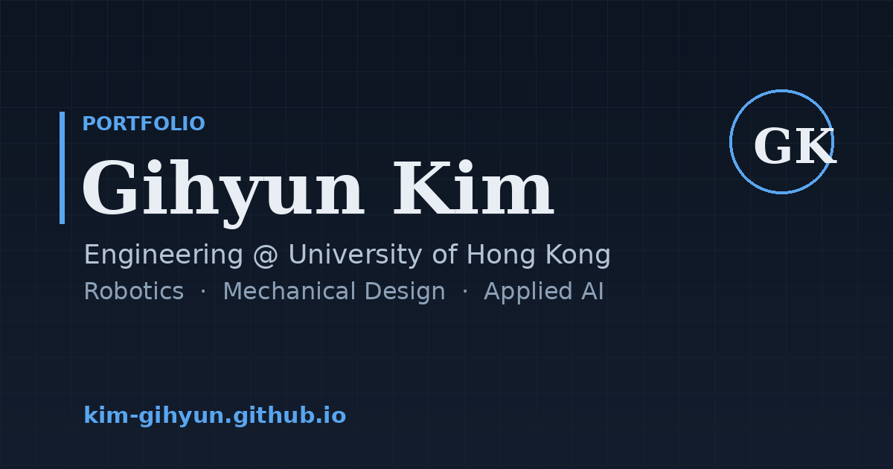

<div align="center">

<a href="https://kim-gihyun.github.io">
  
</a>

# Gihyun Kim — Personal Website

**“Drafting ideas. Building reality.”**

Robotics · Mechanical Design · Applied AI — Engineering @ the University of Hong Kong

### →&nbsp; [**Visit the live site**](https://kim-gihyun.github.io) &nbsp;←

<br>

[](https://kim-gihyun.github.io)
&nbsp;
[](https://kim-gihyun.github.io/assets/cv.pdf)
&nbsp;
[](https://www.linkedin.com/in/gihyun-kim)

<br>


</div>

---

A multi-page personal site with an **“engineering drawing set”** identity — every page is a
numbered sheet with its own title block, drawn in *Lora + Inter + IBM Plex Mono* on technical-paper
grid. No framework, no build step, no database. Just hand-written HTML, CSS, and vanilla JS.

<table>
  <tr>
    <td><b>Drawing no.</b></td><td>GK-26-01</td>
    <td><b>Sheets</b></td><td>06</td>
    <td><b>Stack</b></td><td>HTML · CSS · Vanilla JS · Three.js</td>
  </tr>
  <tr>
    <td><b>Drawn by</b></td><td>G. Kim</td>
    <td><b>Hosting</b></td><td>GitHub Pages</td>
    <td><b>Build</b></td><td>None — static files</td>
  </tr>
</table>

## ✦ Highlights

- **Live 3D models** — Robocon robot and project assemblies render in-browser via Three.js, with a wireframe-to-solid intro and a SECTION A–A cut slider.
- **Drawing-sheet project cards** — each opens into a full “sheet” modal with a revision history and title block.
- **Animated journey map** — an SVG route that draws itself across the places I’ve lived and worked.
- **Crafted motion** — scroll reveals, a drafting-crosshair cursor, magnetic buttons, and smooth page-to-page transitions.
- **Bilingual** — English / 한국어 toggle.
- **Dark mode**, image lightbox, full keyboard access, and `prefers-reduced-motion` support throughout.

## 🗂 Project structure

```
index.html      Home — name, hero 3D model, "active work orders"
about.html      About me + portrait
cv.html         Full CV (print-ready, PDF download)
projects.html   Engineering projects — drawing-sheet cards + lightbox
personal.html   Journey map, songs, life photos
blog.html       Log index (auto-built from posts.json)
post.html       Renders a single Markdown post
404.html        Custom not-found sheet

style.css       Theme — all colors & fonts live at the top, under :root
main.js         Shared interactivity (nav, reveals, modals, cursor)
viewer.js       Three.js model viewer
i18n.js         EN / KO translation strings
posts.json      Blog index — one entry per post
now.json        "Active work orders" shown on the home page
posts/          Blog posts in Markdown
assets/         Images, 3D models (.glb), portrait, cv.pdf
```

## 🛠 Built with

Plain **HTML5 · CSS3 · vanilla JavaScript**, with **[Three.js](https://threejs.org/)** for the
interactive 3D viewers. Type is set in **Lora**, **Inter**, and **IBM Plex Mono** via Google Fonts.
Everything is static — open the files and it runs.

---

<details>
<summary><b>📸 Adding your photos</b></summary>

<br>

Drop these into `assets/` with these exact names:

- **`profile.jpg`** — portrait shown on the Home and About pages.
- **`trolley-built.jpg`** — the assembled aluminium trolley (third image on the Robocon Trolley project).

If a file is a PNG, keep the real extension and update the matching `src="..."` in the HTML rather than renaming it to `.jpg`. The assembled-robot photo (`assets/robocon-assembled.png`) is already included.

</details>

<details>
<summary><b>✍️ Adding a blog post (2 steps)</b></summary>

<br>

**1.** Create `posts/2026-06-10-title.md` and write Markdown (start with `# Title`).

**2.** Add an entry to the **top** of `posts.json`:

```json
{ "title": "My update", "file": "2026-06-10-title.md",
  "date": "2026-06-10", "tags": ["research"], "excerpt": "One-line summary." }
```

Use the `YYYY-MM-DD` date format. The post then appears on the Log automatically.

</details>

<details>
<summary><b>💻 Previewing locally</b></summary>

<br>

The blog and models fetch files, so use a local server (don’t just double-click the HTML):

```bash
cd this-folder
python3 -m http.server 8000   # then open http://localhost:8000
```

</details>

<details>
<summary><b>🚀 Deploying updates</b></summary>

<br>

The site lives on **GitHub Pages** at `https://kim-gihyun.github.io`.

To update: edit or upload files in the repo (root level), commit, and Pages rebuilds in ~1 minute.
Repo **Settings → Pages** → Source: *Deploy from a branch* → branch `main`, folder `/ (root)`.

</details>

<details>
<summary><b>🎨 Changing the look</b></summary>

<br>

Every color and font is defined at the top of `style.css` under `:root`. Swap `--accent` for a
different blue, or adjust `--paper` between off-white and pure white. Dark-mode values live in the
`html.dark { … }` block lower down.

</details>

---

<div align="center">
<sub>© 2026 Gihyun Kim — all sheets. Built by hand, no framework.</sub>
</div>
